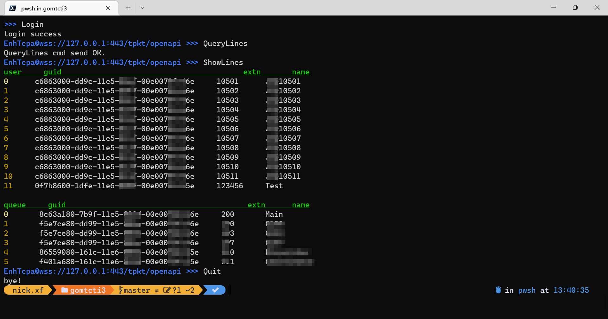

# A command line tool to connect MTCTI3 server

**Prerequisites:**
| Server  | Version  |
|---|---|
| IP office 500 V2  | 11.1 and above  |

## Screenshot


## How to use

Go to the config folder, rename the "config_sample.yml" to config.yml, and edit the config parameters.

## Build command:
```
go build -o ./ .\cmd\cticonsole\ 
```

build for linux on windows:
```
set GOOS=linux
set GOARCH=amd64
```

powershell:
```
$Env:GOOS = "linux"; $Env:GOARCH = "amd64"
```

build for android on windows:
```
$Env:GOOS = "android"; $Env:GOARCH = "arm64"
go build -o ./cticonsole_android .\cmd\cticonsole\ 
```

build for windows on linux:

```
env GOOS=windows GOARCH=amd64 go build
```

Reference link: [https://www.devconnectprogram.com/site/global/products_resources/ip_office/releases/11_1/index.gsp](https://www.devconnectprogram.com/site/global/products_resources/ip_office/releases/11_1/index.gsp) 

